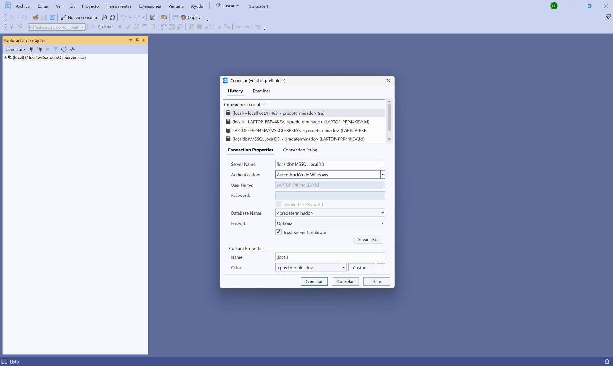
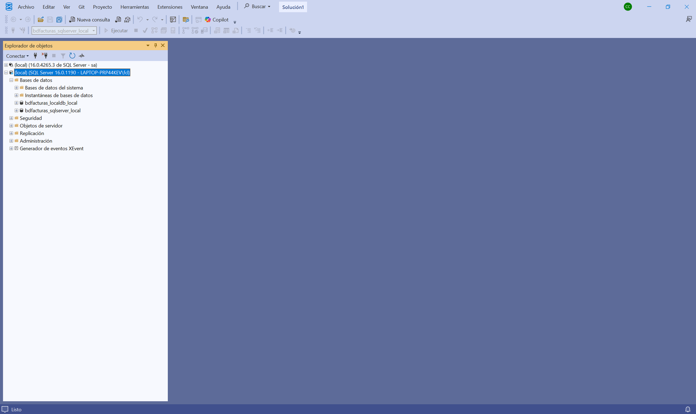
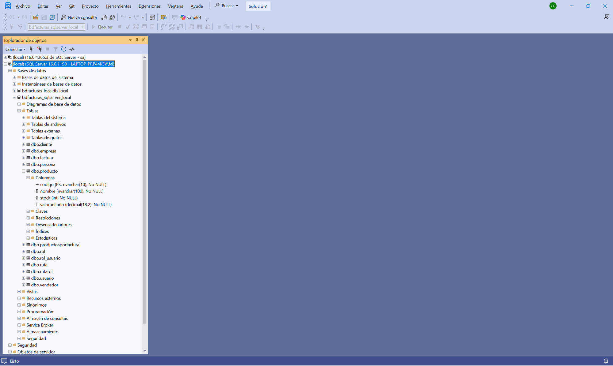
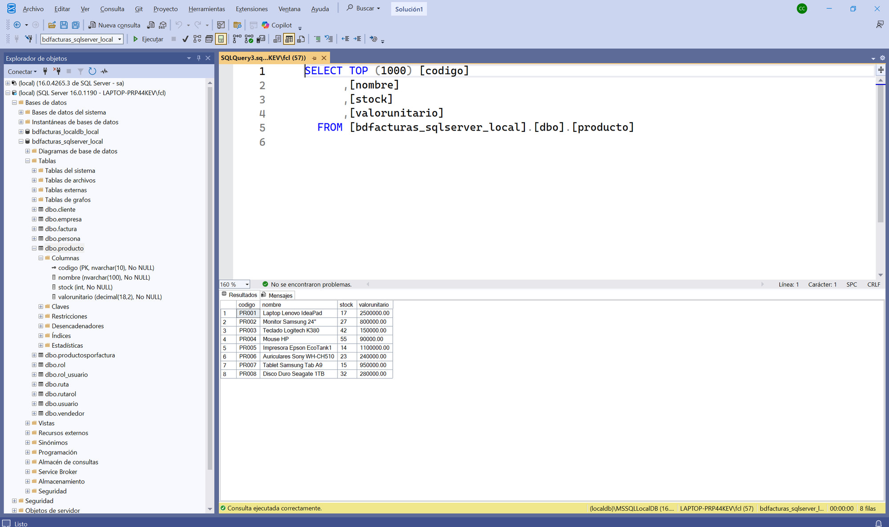
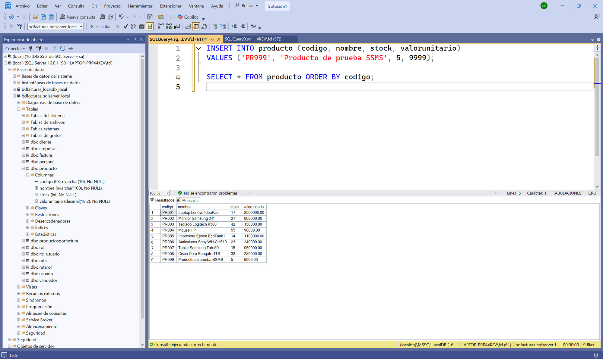
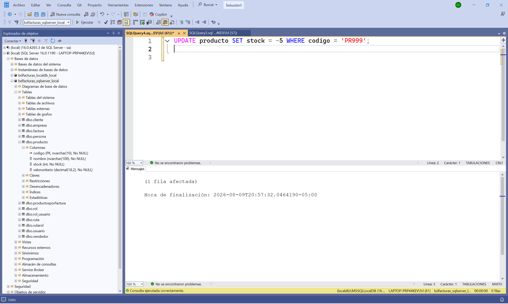
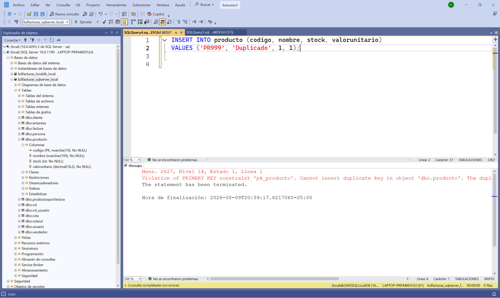
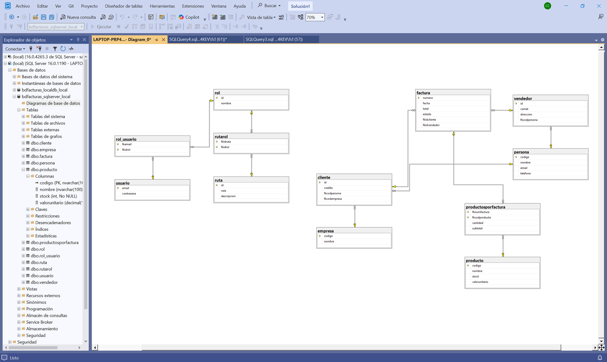

# Tutorial — Administrar la base de datos con SQL Server Management Studio (SSMS)

> Tutorial paso a paso para explorar y administrar
> **bdfacturas_sqlserver_local** (la BD del proyecto) usando **SQL Server
> Management Studio (SSMS)**, el administrador oficial de SQL Server.
>
> Prerrequisito: haber creado la BD al menos una vez (`.\db\crear_bd.ps1`
> desde la raíz del repositorio, ver [README](../README.md)).

---

## Paso 1 — Instalar y abrir SSMS

SSMS es una aplicación de escritorio gratuita de Microsoft (no viene con
Visual Studio: se instala aparte). Descárguela de la página oficial:

**https://aka.ms/ssms**

Instalación siguiente-siguiente; no pide configurar nada. Al abrirla,
SSMS muestra de una vez el diálogo **Conectar** (en las versiones
recientes tiene el aspecto de la captura; en versiones anteriores la
ventana se llama *Connect to Server* — los campos son los mismos):


Para leer en esta pantalla:

- La pestaña **History** lista las conexiones recientes: con el uso, la
  del proyecto quedará ahí para reconectar con un clic.
- **Connection Properties** es donde se llena todo lo del paso 2:
  *Server Name*, *Authentication* y el check **Trust Server Certificate**.
- Detrás quedó la ventana principal con el **Explorador de objetos**
  vacío — se llena al conectar.

> 💡 Si en su sala no se puede instalar SSMS, Visual Studio trae un
> explorador equivalente en miniatura: **View → SQL Server Object
> Explorer**. Los conceptos de este tutorial aplican igual.

---

## Paso 2 — Conectarse a LocalDB

La BD del proyecto vive en **LocalDB**, la edición de desarrollo de SQL
Server que viene con Visual Studio. No tiene puerto ni contraseña: se
llama por su **nombre de instancia** y entra con su usuario de Windows.
En el diálogo **Conectar** (pestaña *Connection Properties*) llene así:

| Campo | Valor |
|---|---|
| **Server Name** | `(localdb)\MSSQLLocalDB` |
| Authentication | `Autenticación de Windows` (*Windows Authentication*) |



Para leer en esta pantalla:

- Con *Autenticación de Windows*, **User Name** aparece gris y ya
  lleno con su usuario (`EQUIPO\usuario`): entra usted mismo, sin
  contraseña. *Password* queda deshabilitado — no hay clave que
  recordar ni que filtrar.
- **Database Name** puede quedar en `<predeterminado>`: la BD se
  escoge después, en el Explorador de objetos.

Clic en **Conectar**: la instancia aparece en el **Explorador de
objetos**:



Para leer en esta pantalla:

- El Explorador puede tener **varias conexiones a la vez** — cada
  servidor es un nodo raíz. El nuevo dice la versión y su usuario de
  Windows: `(local) (SQL Server 16.0.xxxx - EQUIPO\usuario)`.
- Bajo **Bases de datos** está **`bdfacturas_sqlserver_local`** — la
  del curso, creada por `.\db\crear_bd.ps1`. Si ve otras bases suyas de
  otros trabajos en la misma instancia, es normal: LocalDB es una sola
  instancia para todo lo suyo.

Si da error de que no encuentra el servidor, la instancia está dormida o
la BD nunca se creó. Desde la raíz del repositorio:

```powershell
sqllocaldb start MSSQLLocalDB   # despierta la instancia
.\db\crear_bd.ps1               # crea la BD si no existe (idempotente)
```

---

## Paso 3 — Explorar la base de datos y sus objetos

En el Explorador de objetos expanda: **Bases de datos →
`bdfacturas_sqlserver_local` → Tablas**, y dentro de **`dbo.producto`**
expanda **Columnas**:



Para leer en esta pantalla:

- **Tablas** — las **12 tablas** de bdfacturas, con el prefijo `dbo.`
  (el esquema por defecto de SQL Server): cliente, empresa, factura,
  persona, producto, productosporfactura, vendedor y el módulo de
  seguridad (rol, rol_usuario, ruta, rutarol, usuario). Todo esto lo
  creó `.\db\crear_bd.ps1` a partir de `db/bdfacturas.sql`.
- **Columnas** de producto: `codigo (PK, nvarchar(10), No NULL)` — la
  llavecita = llave primaria —, `nombre (nvarchar(100))`, `stock (int)`
  y `valorunitario (decimal(18,2))`. Compare con el modelo `Producto`
  de la API: los mismos tipos vistos desde el motor (es la tabla del
  [modelo de datos](spec_kit/versiones/v1_producto_sqlserver/5_data_model.md)).
- **Claves / Restricciones / Desencadenadores** — la llave primaria y
  los **triggers** de facturación ("desencadenadores" en español), ya
  escritos y esperando a las versiones siguientes del curso. En el paso
  5 se verá con precisión QUÉ reglas hace cumplir esta BD (y cuáles no).
- Más abajo, **Programación → Procedimientos almacenados** guarda los
  SP de facturación (misma historia: infraestructura dada desde la v1).
- Las carpetas *Tablas del sistema*, *Vistas*, *Service Broker*, etc.
  son partes estándar del motor — no las creó el curso.

> 💡 La regla de la v1 sigue vigente aquí: la BD completa se VE, pero el
> código de la versión solo toca la tabla `producto`.

---

## Paso 4 — Ver y editar datos

Clic derecho sobre **`dbo.producto`** → **Seleccionar las 1000 filas
superiores** (*Select Top 1000 Rows*). SSMS escribe la consulta por
usted, la ejecuta y muestra los resultados:



Para leer en esta pantalla:

- **La consulta generada** (arriba) es SQL normal, con los manierismos
  de SQL Server: `TOP (1000)` en vez de `LIMIT`, corchetes `[...]` en
  los nombres, y el nombre completo de la tabla en tres partes:
  `[bdfacturas_sqlserver_local].[dbo].[producto]` (BD → esquema → tabla).
- **Resultados** (abajo): los **8 productos de fábrica** (PR001–PR008)
  que sembró `db/bdfacturas.sql`. Con la API corriendo (`dotnet watch
  run`), compare con `http://localhost:8032/api/producto`: es la MISMA
  información — una vista por SQL y otra por la API.
- **La barra de estado** (abajo a la derecha) resume la sesión: la
  instancia `(localdb)\MSSQLLocalDB`, su usuario de Windows, la BD y
  **8 filas**.

También existe **Editar las 200 filas superiores** (*Edit Top 200
Rows*): abre la tabla en modo edición, como una hoja de cálculo. Cambie
el stock de un producto, refresque el GET de la API y véalo cambiado.

> ⚠️ *Editar filas* escribe DIRECTO en la BD, sin pasar por la API ni
> por sus validaciones. Es útil para administrar, pero en el flujo
> normal del curso los datos entran por la API (que es quien valida).

---

## Paso 5 — Ejecutar sus propias consultas

Botón **Nueva consulta** (`Ctrl+N`), con la conexión de LocalDB activa.
Verifique en el **combo de la barra de herramientas** que está parado
sobre `bdfacturas_sqlserver_local` (ese combo decide DÓNDE se ejecuta
lo que escriba — equivale al `USE` de SQL) y ejecute con **F5** (o el
botón *Ejecutar*):

```sql
INSERT INTO producto (codigo, nombre, stock, valorunitario)
VALUES ('PR999', 'Producto de prueba SSMS', 5, 9999);

SELECT * FROM producto ORDER BY codigo;
```



Para leer en esta pantalla:

- El SELECT ahora trae **9 filas** (lo confirma la barra de estado):
  los 8 de fábrica más su `PR999` al final.
- Véalo también por la otra puerta: con la API corriendo,
  `http://localhost:8032/api/producto` muestra el mismo PR999 — SSMS y
  la API le hablan a la MISMA base de datos.
- Un batch puede llevar varias sentencias: el INSERT y el SELECT se
  ejecutaron juntos, en orden.

Ahora intente algo que DEBERÍA estar prohibido — un stock negativo:

```sql
UPDATE producto SET stock = -5 WHERE codigo = 'PR999';
```



**"(1 fila afectada)" — ¡la BD lo ACEPTA!** Y esa es la lección más
importante de este paso:

- La tabla `producto` solo tiene restricciones **estructurales**: la
  llave primaria, los tipos y los `NOT NULL`. **No hay CHECK de
  rangos** (véalo usted mismo en `db/bdfacturas.sql`).
- ¿Quién prohíbe entonces el stock negativo? **La API**: la petición
  del verbo declara `[Range(0, …)]`, así que por la puerta de la API un
  stock `-5` muere en **422** sin tocar la BD (pruébelo: el mismo
  cambio vía PATCH es rechazado).
- Por SQL directo usted entra POR DETRÁS de esa muralla. Por eso en el
  flujo del curso los datos entran por la API — y por eso conectarse
  como administrador exige respeto.

La regla que la BD SÍ hace cumplir aquí es la **llave primaria** —
pruebe a insertar un código repetido:

```sql
INSERT INTO producto (codigo, nombre, stock, valorunitario)
VALUES ('PR999', 'Duplicado', 1, 1);
```



Para leer en esta pantalla:

- **Mens. 2627**: *Violation of PRIMARY KEY constraint `pk_producto`.
  Cannot insert duplicate key* — la BD rechazó el duplicado y **"The
  statement has been terminated"**: la fila NO entró (la barra de abajo
  lo confirma: 0 filas).
- `pk_producto` es el nombre que `db/bdfacturas.sql` le dio a la llave
  primaria — el mismo que vio en el árbol del paso 3.
- Compare las dos caras del paso: el stock negativo ENTRÓ (no hay regla
  en la BD); el código repetido NO (la PK sí es regla de la BD). Saber
  QUIÉN hace cumplir CADA regla — la BD o la API — es entender la
  arquitectura.

Y al final repare y limpie la prueba:

```sql
DELETE FROM producto WHERE codigo = 'PR999';
```

---

## Paso 6 — El diagrama de tablas y relaciones

En el Explorador de objetos, dentro de la BD: clic derecho en
**Diagramas de base de datos → Nuevo diagrama de base de datos**. (La
primera vez SSMS pregunta si crea los objetos de soporte de diagramas —
responda **Sí**.) En el cuadro **Agregar tabla** agregue las 12 tablas,
cierre el cuadro y acomode las cajas:



Para leer en el diagrama:

- Cada caja es una tabla; la **llavecita dorada** marca su llave
  primaria.
- Cada línea es una **llave foránea**: la llavecita va del lado "uno" y
  el símbolo ∞ del lado "muchos". Ahí está la historia del negocio:
  **persona** ← cliente y vendedor ← **factura** ←
  **productosporfactura** → **producto**, y aparte el módulo de
  seguridad: **usuario** ↔ rol (vía rol_usuario) ↔ ruta (vía rutarol).
- `productosporfactura` es la tabla puente de la relación
  muchos-a-muchos entre factura y producto — la esquina donde la v2 del
  curso va a trabajar.
- Ese dibujo ES el [modelo de datos de la
  v1](spec_kit/versiones/v1_producto_sqlserver/5_data_model.md),
  dibujado por el motor real.

Si guarda el diagrama (`Ctrl+S`, póngale un nombre), queda dentro de la
propia BD, bajo *Diagramas de base de datos*.

---

## Paso 7 — Backup y restore desde SSMS

SSMS también respalda con clic derecho sobre la BD: **Tasks → Back Up…**
y **Tasks → Restore → Database…**. Como LocalDB corre directo en su
máquina, las rutas de esos diálogos SÍ son las de su disco: puede
apuntar el destino del `.bak` a la carpeta `backupdb\` del repositorio.

El método por comandos (equivalente, un solo comando) está en
[backupdb/README.md](../backupdb/README.md) — use el que prefiera; la
convención de nombres y la carpeta son las mismas.

---

## Precauciones finales

- Con Windows Authentication usted entra como **administrador** de la
  instancia: puede borrar cualquier tabla o la BD entera. Con poder
  viene responsabilidad.
- Para volver la BD a su estado inicial de fábrica no necesita backup:
  borre la BD (clic derecho → *Delete*, marcando *Close existing
  connections*) y vuelva a correr `.\db\crear_bd.ps1`.
- Las tablas distintas de `producto` son infraestructura de las
  versiones siguientes: mírelas todo lo que quiera, pero no las
  modifique.
