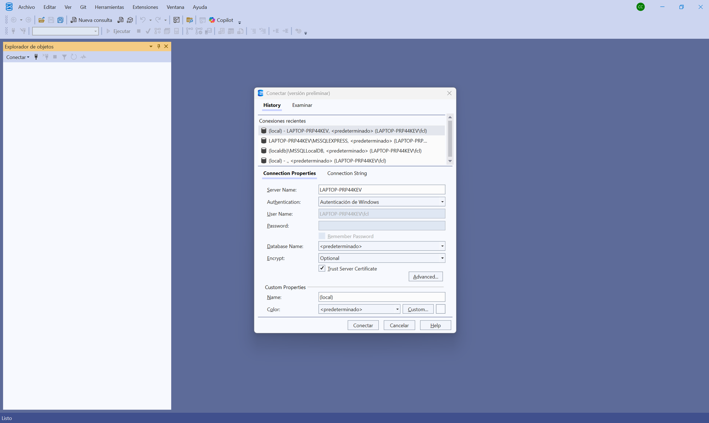

# Tutorial — Administrar la base de datos con SQL Server Management Studio (SSMS)

> Tutorial paso a paso para explorar y administrar
> **bdfacturas_sqlserver_local** (la BD del proyecto) usando **SQL Server
> Management Studio (SSMS)**, el administrador oficial de SQL Server.
>
> Prerrequisito: haber creado la BD al menos una vez (`.\db\crear_bd.ps1`
> desde la raíz del repositorio, ver [README](../README.md)).

---

## Paso 1 — Instalar y abrir SSMS

SSMS es una aplicación de escritorio gratuita de Microsoft (no viene con
Visual Studio: se instala aparte). Descárguela de la página oficial:

**https://aka.ms/ssms**

Instalación siguiente-siguiente; no pide configurar nada. Al abrirla,
SSMS muestra de una vez el diálogo **Conectar** (en las versiones
recientes tiene el aspecto de la captura; en versiones anteriores la
ventana se llama *Connect to Server* — los campos son los mismos):



Para leer en esta pantalla:

- La pestaña **History** lista las conexiones recientes: con el uso, la
  del proyecto quedará ahí para reconectar con un clic.
- **Connection Properties** es donde se llena todo lo del paso 2:
  *Server Name*, *Authentication* y el check **Trust Server Certificate**.
- Detrás quedó la ventana principal con el **Explorador de objetos**
  vacío — se llena al conectar.

> 💡 Si en su sala no se puede instalar SSMS, Visual Studio trae un
> explorador equivalente en miniatura: **View → SQL Server Object
> Explorer**. Los conceptos de este tutorial aplican igual.

---

## Paso 2 — Conectarse a LocalDB

La BD del proyecto vive en **LocalDB**, la edición de desarrollo de SQL
Server que viene con Visual Studio. No tiene puerto ni contraseña: se
llama por su **nombre de instancia** y entra con su usuario de Windows.
En el diálogo **Conectar** (pestaña *Connection Properties*) llene así:

| Campo | Valor |
|---|---|
| **Server Name** | `(localdb)\MSSQLLocalDB` |
| Authentication | `Autenticación de Windows` (*Windows Authentication*) |

Clic en **Conectar**: el **Explorador de objetos** (panel izquierdo) se
llena con la instancia conectada.

Si da error de que no encuentra el servidor, la instancia está dormida o
la BD nunca se creó. Desde la raíz del repositorio:

```powershell
sqllocaldb start MSSQLLocalDB   # despierta la instancia
.\db\crear_bd.ps1               # crea la BD si no existe (idempotente)
```

---

## Paso 3 — Explorar la base de datos y sus objetos

En el Object Explorer expanda: **Databases →
`bdfacturas_sqlserver_local`**. Ahí está TODA la estructura que creó
`db/crear_bd.ps1` a partir de `db/bdfacturas.sql`:

- **Tables** — las **12 tablas** de bdfacturas (con el prefijo `dbo.`,
  el esquema por defecto de SQL Server). Expanda `dbo.producto`:
  - **Columns**: las 4 columnas con sus tipos (`codigo` con llave dorada
    = llave primaria).
  - **Claves / Restricciones**: la llave primaria (en el paso 5 se verá
    con precisión QUÉ reglas hace cumplir esta BD y cuáles no).
  - **Desencadenadores**: los triggers de facturación — ya están
    escritos, esperando a las versiones siguientes del curso.
- **Programmability → Stored Procedures** — los procedimientos
  almacenados de facturación (misma historia: infraestructura dada
  desde la v1).

> 💡 La regla de la v1 sigue vigente aquí: la BD completa se VE, pero el
> código de la versión solo toca la tabla `producto`.

---

## Paso 4 — Ver y editar datos

Clic derecho sobre **`dbo.producto`**:

- **Select Top 1000 Rows** — abre una consulta ya escrita con los datos
  de la tabla. Con la API corriendo (`dotnet watch run`), compare con
  `http://localhost:8032/api/producto`: es la MISMA información, una
  vista por SQL y otra por la API.
- **Edit Top 200 Rows** — abre la tabla en modo edición (como una hoja
  de cálculo). Cambie el stock de un producto, refresque el GET de la
  API y véalo cambiado.

> ⚠️ *Edit Top 200 Rows* escribe DIRECTO en la BD, sin pasar por la API
> ni por sus validaciones. Es útil para administrar, pero en el flujo
> normal del curso los datos entran por la API (que es quien valida).

---

## Paso 5 — Ejecutar sus propias consultas

Botón **New Query** (o `Ctrl+N`). Verifique en el combo de la barra (o
con `USE`) que está parado sobre la BD correcta y ejecute con **F5** (o
el botón *Execute*):

```sql
USE bdfacturas_sqlserver_local;

-- Leer
SELECT * FROM producto ORDER BY codigo;

-- Insertar (luego véalo en el GET de la API)
INSERT INTO producto (codigo, nombre, stock, valorunitario)
VALUES ('PR999', 'Producto de prueba SSMS', 5, 9999);

-- Y limpiar la prueba
DELETE FROM producto WHERE codigo = 'PR999';
```

Ahora intente algo que DEBERÍA estar prohibido — un stock negativo:

```sql
UPDATE producto SET stock = -5 WHERE codigo = 'PR999';
```

**"(1 fila afectada)" — ¡la BD lo ACEPTA!** Y esa es la lección más
importante de este paso:

- La tabla `producto` solo tiene restricciones **estructurales**: la
  llave primaria, los tipos y los `NOT NULL`. **No hay CHECK de
  rangos** (véalo usted mismo en `db/bdfacturas.sql`).
- ¿Quién prohíbe entonces el stock negativo? **La API**: la petición
  del verbo declara `[Range(0, …)]`, así que por la puerta de la API un
  stock `-5` muere en **422** sin tocar la BD (pruébelo: el mismo
  cambio vía PATCH es rechazado).
- Por SQL directo usted entra POR DETRÁS de esa muralla. Por eso en el
  flujo del curso los datos entran por la API — y por eso conectarse
  como administrador exige respeto.

La regla que la BD SÍ hace cumplir aquí es la **llave primaria** —
pruebe a insertar un código repetido:

```sql
INSERT INTO producto (codigo, nombre, stock, valorunitario)
VALUES ('PR999', 'Duplicado', 1, 1);
-- Error 2627: Violation of PRIMARY KEY constraint 'pk_producto'
```

---

## Paso 6 — El diagrama de tablas y relaciones

En el Object Explorer, dentro de la BD: clic derecho en **Database
Diagrams → New Database Diagram**. (La primera vez SSMS pregunta si crea
los objetos de soporte de diagramas — responda **Yes**.)

En el cuadro *Add Table* agregue las 12 tablas y SSMS dibuja el modelo
relacional completo: cada tabla como una caja (llave dorada = PK) y cada
**llave foránea** como una línea entre cajas: persona ← cliente ←
factura ← productosporfactura → producto, más el módulo de seguridad
(usuario, rol, ruta y sus tablas puente).

Ese diagrama ES el [modelo de datos de la
v1](spec_kit/versiones/v1_producto_sqlserver/5_data_model.md), dibujado
por el motor real.

---

## Paso 7 — Backup y restore desde SSMS

SSMS también respalda con clic derecho sobre la BD: **Tasks → Back Up…**
y **Tasks → Restore → Database…**. Como LocalDB corre directo en su
máquina, las rutas de esos diálogos SÍ son las de su disco: puede
apuntar el destino del `.bak` a la carpeta `backupdb\` del repositorio.

El método por comandos (equivalente, un solo comando) está en
[backupdb/README.md](../backupdb/README.md) — use el que prefiera; la
convención de nombres y la carpeta son las mismas.

---

## Precauciones finales

- Con Windows Authentication usted entra como **administrador** de la
  instancia: puede borrar cualquier tabla o la BD entera. Con poder
  viene responsabilidad.
- Para volver la BD a su estado inicial de fábrica no necesita backup:
  borre la BD (clic derecho → *Delete*, marcando *Close existing
  connections*) y vuelva a correr `.\db\crear_bd.ps1`.
- Las tablas distintas de `producto` son infraestructura de las
  versiones siguientes: mírelas todo lo que quiera, pero no las
  modifique.
