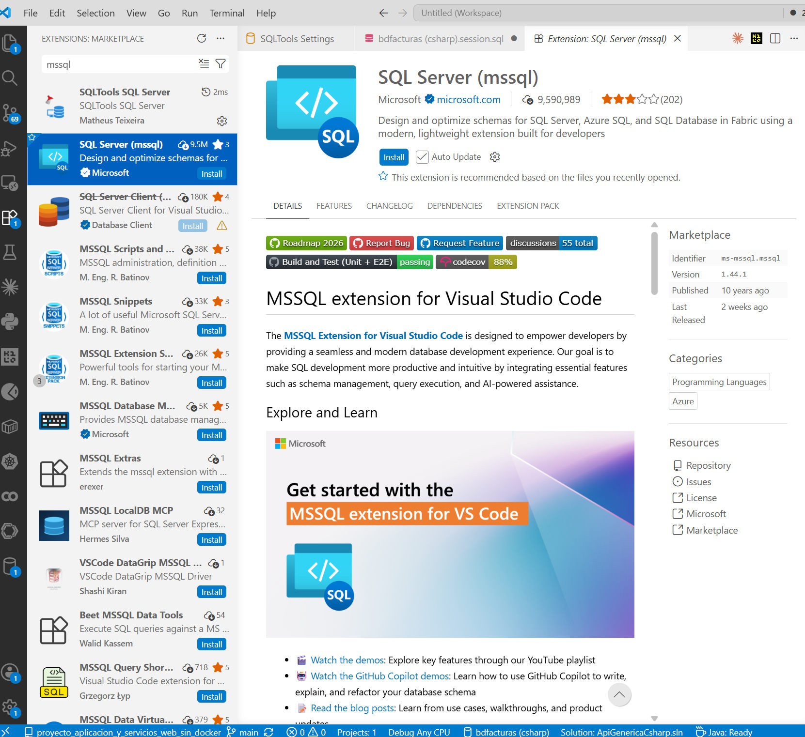
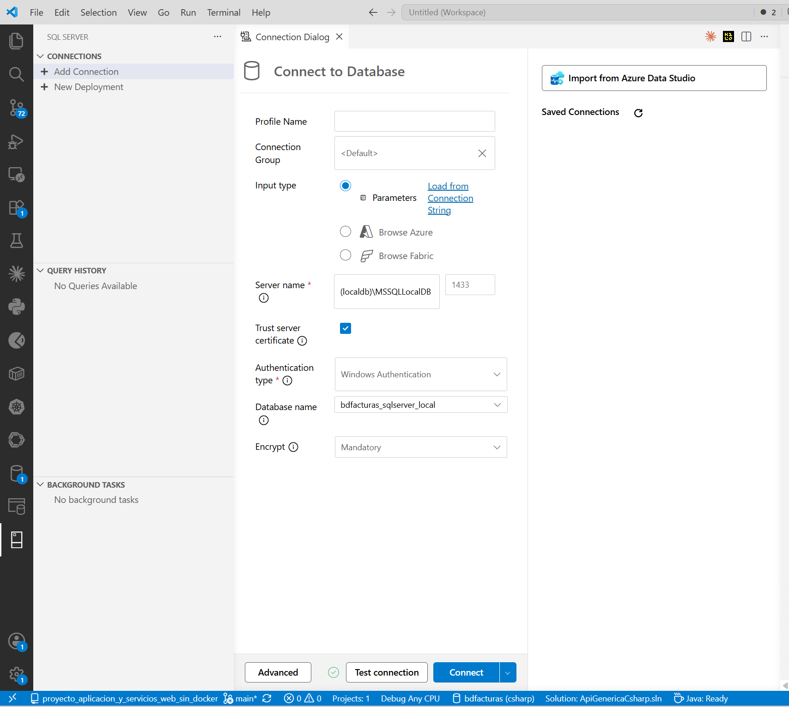
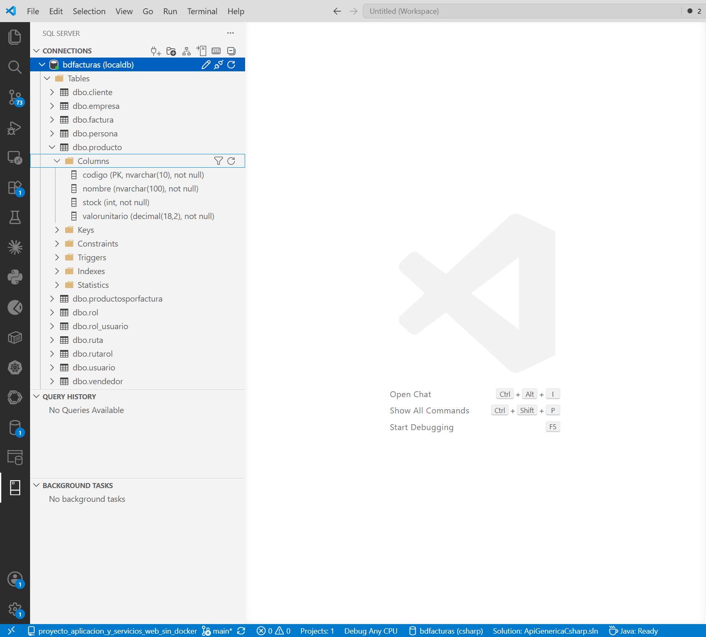
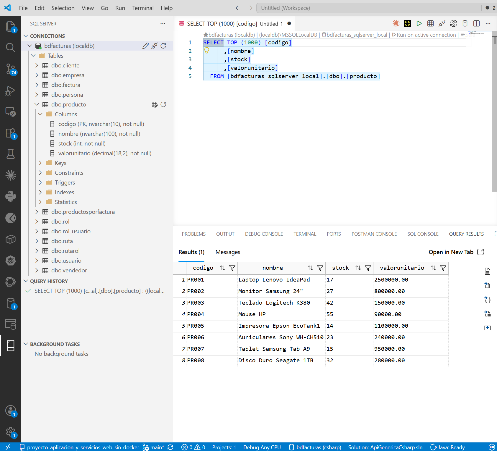
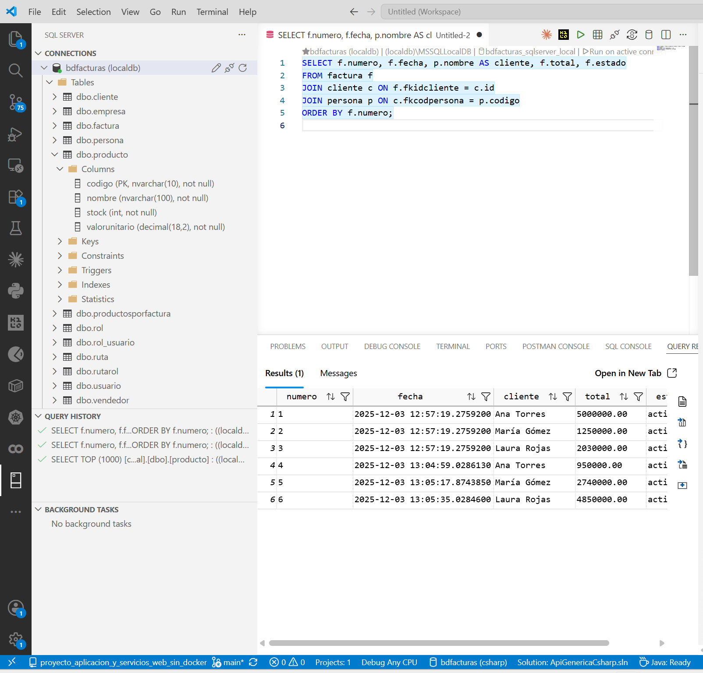
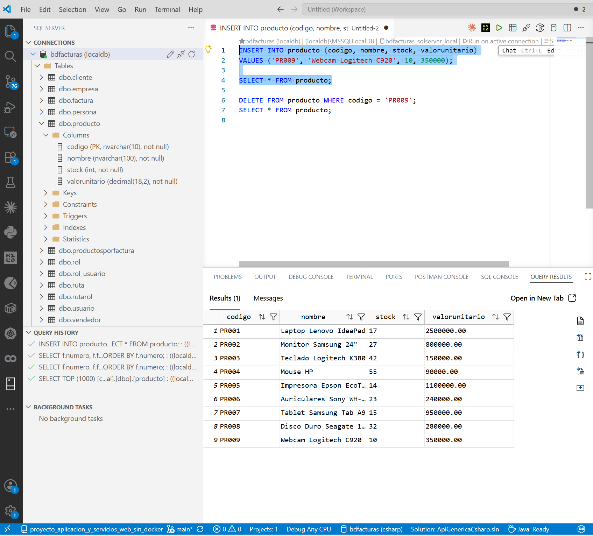
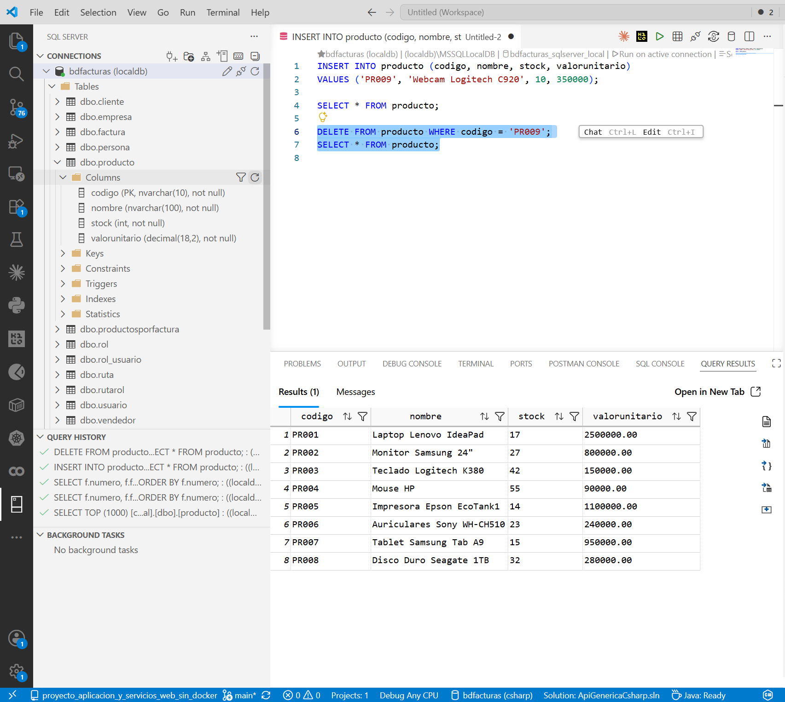

# Tutorial — Administrar LocalDB desde VS Code con la extensión SQL Server (mssql)

> Tutorial paso a paso para explorar y consultar **bdfacturas** sin salir
> de VS Code, usando la extensión oficial de Microsoft **SQL Server
> (mssql)**. Es la alternativa "de programador" al [tutorial de
> SSMS](TUTORIAL_SSMS.md): misma base de datos, pero en el editor donde ya
> está su código — ideal para consultar mientras programa.
>
> **Prerrequisitos:** VS Code en Windows y la BD creada al menos una vez
> (`.\db\crear_bd.ps1` desde la raíz — ver el [README](../README.md)).
>
> **¿Por qué esta extensión y no otra?** LocalDB **no es un servidor de
> red**: no tiene puerto. Es una mini-instancia que Windows arranca bajo
> demanda y se habla por un canal interno del sistema (named pipes). A
> ese canal solo saben hablarle las herramientas de Microsoft — SSMS,
> Visual Studio y esta extensión. Los administradores "genéricos" que
> conectan por dirección + puerto TCP no tienen cómo llegarle.

---

## Paso 0 — Instalar la extensión

Abra la vista de **Extensiones** (`Ctrl+Shift+X`), busque `mssql` e
instale **SQL Server (mssql)** — la de **Microsoft** (verifique el
identificador `ms-mssql.mssql` en el panel Marketplace; en la lista hay
varias parecidas de otros autores):



Una sola extensión — a diferencia de otros administradores, esta no usa
drivers aparte. Al instalarla aparece un ícono de **SQL Server** en la
barra lateral izquierda.

---

## Paso 1 — Conectarse a LocalDB

Clic en el ícono de **SQL Server** de la barra lateral y luego en
**Add Connection** (agregar conexión). Llene:

| Campo | Valor |
|---|---|
| Profile Name | `bdfacturas (localdb)` (libre — el nombre de la conexión guardada) |
| Input type | `Parameters` (el formulario; lo demás es para Azure) |
| Server name | `(localdb)\MSSQLLocalDB` |
| Trust server certificate | ✅ marcado |
| Authentication type | `Windows Authentication` (sin usuario ni clave) |
| Database name | `bdfacturas_sqlserver_local` |
| Encrypt | `Mandatory` (el que viene — funciona gracias al *Trust*) |



Para leer en esta pantalla:

- Con *Windows Authentication* no hay campos de usuario ni contraseña:
  entra usted mismo.
- En **Database name** escriba (o pegue) el nombre TAL CUAL:
  `bdfacturas_sqlserver_local`. Es un campo de texto con desplegable —
  no siempre lista las bases antes de conectar, y escribirlo funciona
  igual.
- El campo de **puerto** (1433) se ignora: LocalDB no habla por red —
  el nombre `(localdb)\...` va por el canal interno de Windows.

**Test connection** debe responder con el chulo verde; luego
**Connect**: la instancia aparece en el panel CONNECTIONS con su base
de datos.

> Si falla porque no encuentra el servidor, la instancia está dormida o
> la BD no existe. Desde la raíz del repositorio:
>
> ```powershell
> sqllocaldb start MSSQLLocalDB   # despierta la instancia
> .\db\crear_bd.ps1               # crea la BD si no existe (idempotente)
> ```

---

## Paso 2 — Explorar la base de datos

Expanda el árbol: **bdfacturas (localdb)** → **Tables** (como la
conexión quedó apuntando directo a la BD del curso, el árbol arranca en
sus tablas), y dentro de **dbo.producto** expanda **Columns**:



Para leer en el árbol:

- Las **12 tablas** con el prefijo `dbo.` (el esquema por defecto de
  SQL Server): cliente, empresa, factura, persona, producto,
  productosporfactura, vendedor y el módulo de seguridad (rol,
  rol_usuario, ruta, rutarol, usuario). Todo lo creó
  `.\db\crear_bd.ps1` a partir de `db/bdfacturas.sql`.
- En **Columns** de producto: `codigo (PK, nvarchar(10), not null)` —
  la llave primaria — `nombre`, `stock (int)` y
  `valorunitario (decimal(18,2))`: los mismos tipos del modelo
  `Producto` de la API, vistos desde el motor.
- La tabla también expone **Keys / Constraints / Triggers / Indexes** —
  los triggers de facturación están ahí, esperando a las versiones
  siguientes del curso.

Ahora, clic derecho sobre **dbo.producto** → **Select Top 1000**: la
extensión escribe la consulta, la ejecuta y muestra los resultados:



Para leer en esta pantalla:

- **La consulta generada** es SQL normal con los manierismos de SQL
  Server: `TOP (1000)` en vez de `LIMIT`, corchetes `[...]` y el nombre
  de la tabla en tres partes:
  `[bdfacturas_sqlserver_local].[dbo].[producto]` (BD → esquema → tabla).
- Arriba del editor, la **barra de conexión** dice contra qué se
  ejecuta: el perfil, la instancia y la BD.
- **QUERY RESULTS** (abajo): los **8 productos** de fábrica, con orden
  y filtro por columna, y a la derecha los íconos para **exportar** el
  resultado (CSV, JSON, Excel).
- El panel **QUERY HISTORY** (izquierda) va registrando cada consulta —
  puede volver a cualquiera.

---

## Paso 3 — Consultar con SQL propio

Clic derecho sobre la conexión → **New Query** (o `Ctrl+N` y elija el
lenguaje SQL). Escriba:

```sql
SELECT f.numero, f.fecha, p.nombre AS cliente, f.total, f.estado
FROM factura f
JOIN cliente c ON f.fkidcliente = c.id
JOIN persona p ON c.fkcodpersona = p.codigo
ORDER BY f.numero;
```

Ejecute con **`Ctrl+Shift+E`** (o el botón ▶ *Execute*). Deben salir las
**6 facturas** con su cliente en una grilla:



Para leer en esta pantalla:

- Las **6 facturas** con el nombre del cliente resuelto por el doble
  JOIN (factura → cliente → persona): lo que la tabla guarda como
  `fkidcliente = 3` la consulta lo vuelve "Laura Rojas".
- Las tildes salen bien ("María Gómez") — señal de que la BD se creó
  con la codificación correcta.

> ⚠️ **Si los nombres salen como "María Gómez"**, su BD se creó con
> una versión vieja de `crear_bd.ps1` (sin la opción `-f 65001` que le
> dice a sqlcmd que el script es UTF-8) y las tildes quedaron GUARDADAS
> dañadas. El arreglo: borre la BD y recréela con el script actual —
>
> ```powershell
> sqlcmd -S "(localdb)\MSSQLLocalDB" -E -Q "ALTER DATABASE bdfacturas_sqlserver_local SET SINGLE_USER WITH ROLLBACK IMMEDIATE; DROP DATABASE bdfacturas_sqlserver_local;"
> .\db\crear_bd.ps1
> ```

---

## Paso 4 — Insertar y eliminar con SQL

El ciclo completo de escritura, en la misma pestaña de consulta.
Escriba DEBAJO de la anterior (seleccione cada sentencia y ejecútela por
separado con `Ctrl+Shift+E`):

```sql
INSERT INTO producto (codigo, nombre, stock, valorunitario)
VALUES ('PR009', 'Webcam Logitech C920', 10, 350000);

SELECT * FROM producto;

DELETE FROM producto WHERE codigo = 'PR009';
```

1. El **INSERT** → *1 row affected*.
2. El **SELECT** → **9 productos** (apareció PR009):



3. El **DELETE** → *1 row affected*; repita el SELECT: **8 productos**:



En la última captura se lee la historia completa: el **QUERY HISTORY**
registra SELECT TOP → los JOIN → INSERT (con 9) → DELETE, y la grilla
final vuelve a los **8 productos** — el ciclo de escritura completo sin
salir del editor.

> El mismo respeto que en SSMS: DELETE **siempre con WHERE**. Y la misma
> moraleja: mientras PR009 existió, también existía para la API
> (`http://localhost:8032/api/producto/PR009` con `dotnet watch run`
> corriendo) — un solo dato, muchos clientes.

---

## Cierre — ¿SSMS o la extensión mssql?

Los dos hablan el mismo SQL con la misma BD; cambia el contexto:

| | SSMS | SQL Server (mssql) |
|---|---|---|
| Dónde vive | Aplicación de escritorio aparte | Dentro de VS Code |
| Instalación | Instalador de Microsoft | 1 extensión + conexión |
| Fuerte en | Administrar: diagramas, backup/restore, editar con formularios | Consultar mientras programa; el SQL queda en un archivo |
| Ideal para | Entender y administrar la BD | El día a día escribiendo la API |

No hay que elegir: en este curso conviven. Y la lección de fondo es la
misma: **la base de datos es una sola** — SSMS, la extensión y la API de
C# son solo tres clientes distintos del mismo LocalDB.

## Resumen

| Paso | Qué aprendió |
|---|---|
| 0 | Instalar la extensión oficial (y por qué LocalDB exige herramientas de Microsoft) |
| 1 | Conectarse a `(localdb)\MSSQLLocalDB` con autenticación de Windows |
| 2 | Explorar el árbol: tablas, columnas, PK; Select Top 1000 |
| 3 | SQL propio con `Ctrl+Shift+E`: el JOIN de 3 tablas |
| 4 | Ciclo de escritura: INSERT → verificar → DELETE con WHERE |
